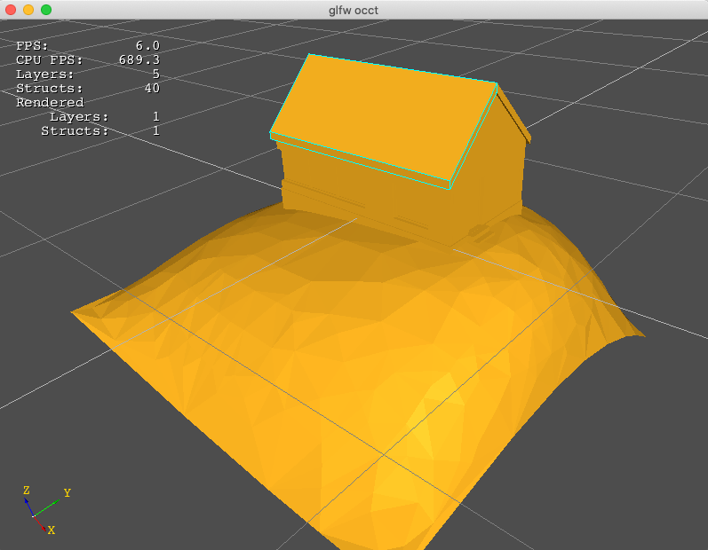

### ifcOcctViewer 

a ifc file viewer by opencascade and glfw

I build with mac&homebrew, have not test on windows and linux. But I think it also works.

Depends:

* [IfcOpenShell](https://github.com/IfcOpenShell/IfcOpenShell)
* [Opencascade](https://www.opencascade.com/content/latest-release)
* [Glfw](https://github.com/glfw/glfw)

### how to build

```
mkdir build
cmake ..
make
```


